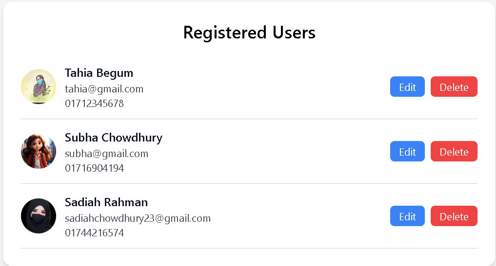

# 🧾 User Registration & Management System

A modern **User Registration and Management System** built using **HTML**, **Tailwind CSS**, **PHP**, **JavaScript**, and **MySQL**.  
This system allows users to register, upload a profile picture, and manage registered users in a clean, responsive interface.

---

## 🌐 Overview

The project includes two main sections:

- **Sign Up Page** – A form where new users register with personal details and a profile image.  
- **Registered Users Page** – Displays a list of all users stored in the database, with options to **Edit** or **Delete** records.

This project demonstrates full-stack web development with a lightweight frontend (Tailwind + JS) and a classic backend (PHP + MySQL).

---

## 🖼️ Screenshots

### 🧍‍♂️ Sign Up Page
The registration form collects user information and profile images.

### 👥 Registered Users Page
Displays a list of all registered users with edit and delete functionality.

---

## ✨ Features

### ✅ User Registration Form
- Collects first name, last name, email, password, phone number, and profile picture.  
- Validates input fields before submission using JavaScript.  
- Uploads images to the server and stores their paths in the database.

### ✅ Database Integration (MySQL)
- Stores user information securely in a MySQL database.  
- Automatically records submission and last update timestamps.  

### ✅ Registered Users Management
- Displays all user records dynamically from the database.  
- Includes Edit and Delete options for managing users.  
- Displays each user’s profile photo, name, and email.

### ✅ Responsive Design
- Built with Tailwind CSS for a clean and mobile-friendly layout.

### ✅ Dynamic Functionality
- JavaScript enhances interactivity and client-side validation.

---

## 🧩 Technologies Used

| Technology | Description |
|-------------|-------------|
| **HTML5** | Provides the structure of the web pages |
| **Tailwind CSS** | For modern, responsive, and elegant UI design |
| **JavaScript (ES6)** | Handles front-end interactivity and validation |
| **PHP (Core PHP)** | Manages backend logic and database operations |
| **MySQL** | Stores and retrieves user data |

---

